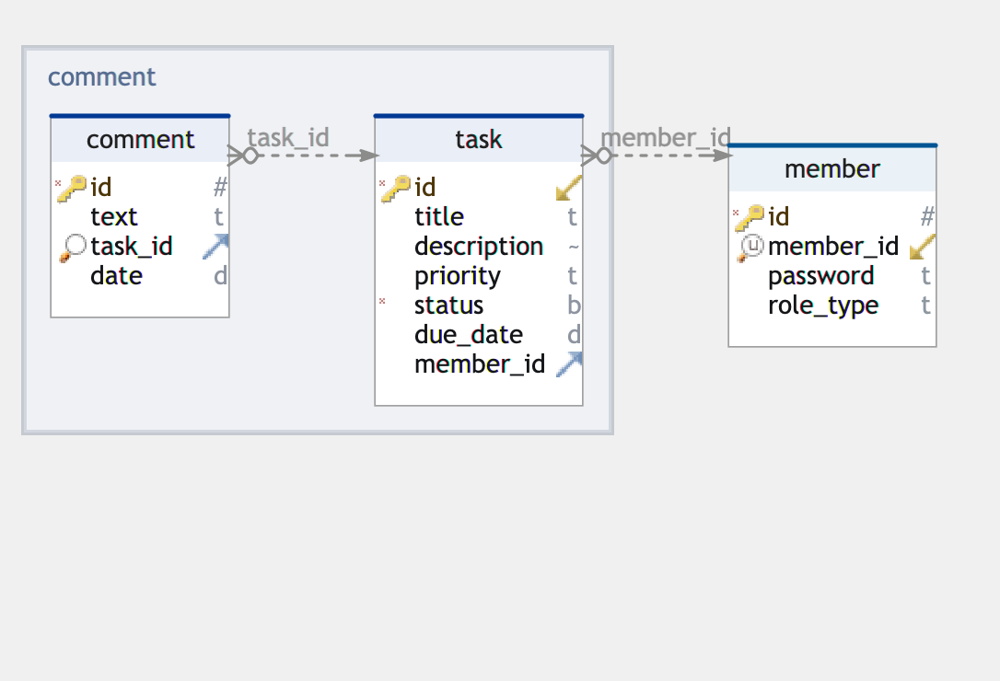

# TodoTask

<small>A simple todo list application that keeps track of your time.</small>
## How To
- To access the application go to: http://localhost:8080/.
- For API interactions use: http://localhost:8080/api/tasks , http://localhost:8080/api/member, http://localhost:8080/api/login and http://localhost:8080/api/comments .
- API Document is available in http://localhost:8080/swagger-ui/index.html#/
- Database is automatically initialized and seeded. For production this needs to be disabled.
- Gradle should build and pack the frontend assets in `static` folder.
- It is possible that you will have to manually initialize the database. To do this use [init.sql](src/main/resources/init.sql) inside `main/resources`.

### Run

```bash
cd todo-task
./gradlew bootRun
cd frontend
npm run serve

# Access the app on http://localhost:8080/
# PreRequisites:
mysql should be running on port 3306 before application runs and root password must be 1234
```

### Build

```bash
./gradlew clean

# Note the -P flag to build the client code
./gradlew build -x test -Pfrontend

java -jar ./build/libs/todo-task-1.0.0-SNAPSHOT.jar
```

### Docker (Recommended)
A `Dockerfile` and `docker-compose.yaml` are available to try out the application without messing around with any settings.
Just run `docker-composer up -d`. The client should be on `http://localhost:8000/` and the api on `http://localhost:8080/api/`.
**WARNING:** Spring Boot takes a while to start, so the client may throw some `500` errors at first.
Please access localhost:8080 to test the functionalities.
## Schema


